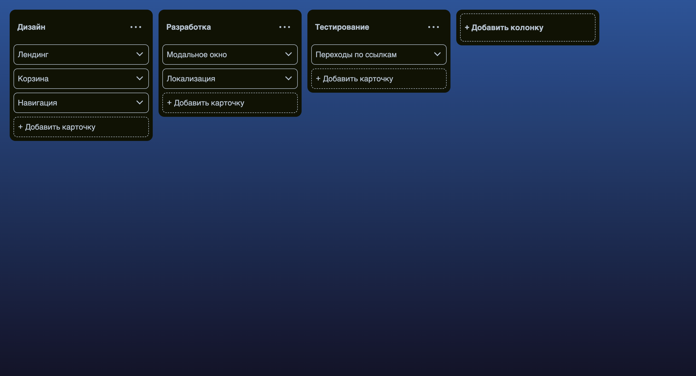

# TODO board

## Описание

Приложение представляет из себя интерактивную доску задач.\
Задачи можно глобально разделить на колонки. Количество колонок и их название можно редактировать\
Внутри каждой колонки есть карточки задач. Карточку можно добавить, переименовать, удалить или отметить как "выполнено"

## Инструкции

- По умолчанию отображается заготовленные колонки и карточки
- Удалить колонку:
  - откройте меню в верхнем правом углу колонки
  - нажмите на **удалить колонку**
- Редактировать заголовок колонки:
  - откройте меню в верхнем правом углу колонки
  - нажмите на **Редактировать**
- Добавить колонку:
  - нажмите на блок **+ Добавить колонку** который находится в конце списка всех колонок
- Установить статус задачи "Выполнено"
  - откройте меню карточки кликнув на саму карточку
  - нажмите на **Переключить статус "Выполнено"**
- Редактировать карточку:
  - откройте меню карточки кликнув на саму карточку
  - нажмите на **Редактировать"**
- Удалить карточку:
  - откройте меню карточки кликнув на саму карточку
  - нажмите на **Удалить карточку**
- Добавить карточку:
  - нажмите на блок **+ Добавить карточку** который находится в конце списка колонки

## Демо

[adwasar.github.io/todo-board](https://adwasar.github.io/todo-board/)

## Технологии

- JavaScript
- SCSS
- React.js
- Redux-toolkit
- Vite
